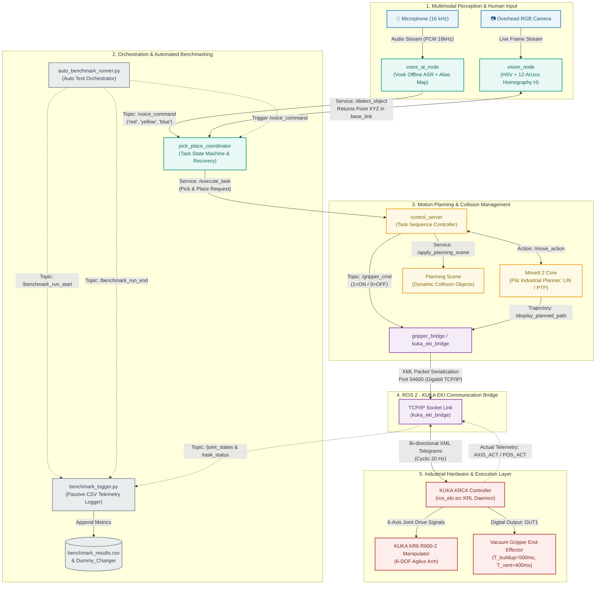
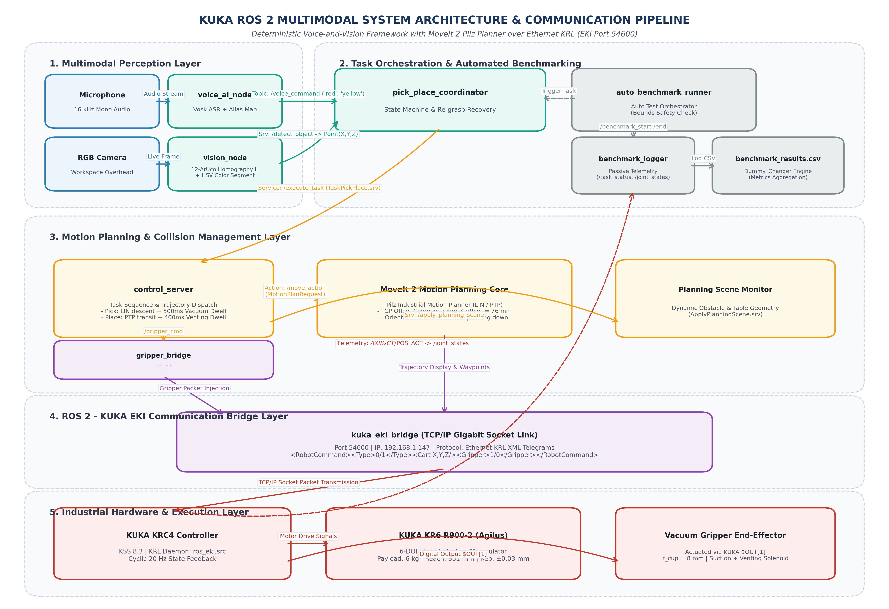

# 🤖 KUKA KR6 ROS 2 System Architecture & Communication Pipeline

Dokumen ini memuat diagram alur (*flowchart*), diagram arsitektur sistem, dan pemetaan komunikasi ROS 2 untuk sistem penanganan material berbasis suara dan visi pada robot industri **KUKA KR6 R900-2 (Agilus)** dengan pengontrol **KUKA KRC4**.

---

## 📊 1. Interactive Mermaid Flowchart (Strict Syntax Verified)

---

## 🖼️ 2. High-Resolution Architecture Diagram (Publication Ready)

Diagram versi gambar beresolusi tinggi (300 DPI) telah disimpan di:
`images/system_architecture_diagram.png`

---

## 📡 3. Rincian Antarmuka Komunikasi ROS 2 (Topics, Services, & Actions)

| Tipe | Nama Interface | Tipe Pesan | Deskripsi Fungsi |
| :--- | :--- | :--- | :--- |
| **Topic (Pub/Sub)** | `/voice_command` | `std_msgs/msg/String` | Pengiriman intent warna target (`red`, `yellow`, `blue`, `green`) hasil decoding Vosk ASR. |
| **Service** | `/detect_object` | `surgical_msgs/srv/DetectObject` | Pemanggilan estimasi koordinat dunia $(X, Y, Z)$ berbasis segmentasi HSV & homografi ArUco. |
| **Service** | `/execute_task` | `surgical_msgs/srv/TaskPickPlace` | Perintah sekuens eksekusi pick-and-place dari koordinator ke `control_server`. |
| **Action** | `/move_action` | `moveit_msgs/action/MoveGroup` | Perencanaan trajektori deterministik (LIN / PTP) MoveIt 2 Pilz Industrial Motion Planner. |
| **Service** | `/apply_planning_scene` | `moveit_msgs/srv/ApplyPlanningScene` | Pembaruan geometri meja dan rintangan collision secara dinamis di MoveIt 2. |
| **Topic (Pub/Sub)** | `/gripper_cmd` | `std_msgs/msg/Int8` | Perintah katup pneumatik pompa vakum (`1 = ON / Pick`, `0 = OFF / Place`). |
| **Topic (Pub/Sub)** | `/joint_states` | `sensor_msgs/msg/JointState` | Umpan balik telemetri posisi sendi aktual ($A1..A6$) dari KRC4 ($AXIS\_ACT$) pada frekuensi 20 Hz. |
| **Topic (Pub/Sub)** | `/benchmark_run_start` | `std_msgs/msg/String` | Metadata awal pengujian benchmark otomatis (`test`, `run`, `color`). |
| **Topic (Pub/Sub)** | `/benchmark_run_end` | `std_msgs/msg/String` | Ringkasan metrik pengujian fisik (`pos_error_mm`, `tracking_error_deg`, `pick_success`). |

---

## ⚙️ 4. Spesifikasi Parameter Teknis Sistem

*   **Manipulator**: KUKA KR6 R900-2 sixx Agilus (6-DOF, Payload 6 kg, Reach 901 mm, Repeatability $\pm 0.03\text{ mm}$).
*   **Controller**: KUKA KRC4 Compact running KUKA System Software (KSS) 8.3.
*   **Ethernet Protocol**: KUKA Ethernet KRL Interface (EKI), Port `54600`, IP Robot `192.168.1.147`.
*   **End-Effector**: Custom Vacuum Gripper dengan Tool Center Point (TCP) offset $Z_{\text{offset}} = 76\text{ mm}$ ($L_{\text{base}} = 60\text{ mm} + L_{\text{bellows}} = 16\text{ mm}$), radius *suction cup* $r = 8\text{ mm}$.
*   **Pneumatic Dwells**: *Vacuum buildup dwell* $T_{\text{vacuum}} = 500\text{ ms}$, *Venting release dwell* $T_{\text{release}} = 400\text{ ms}$.
*   **Kamera & Kalibrasi**: Kamera overhead pada pose observasi $(X=338.56\text{ mm}, Y=10.12\text{ mm}, Z=1091.51\text{ mm})$, 12 penanda ArUco resolusi sub-milimeter.
*   **Speech Recognition Engine**: Vosk offline ASR (`vosk-model-small-en-us`) dengan kamus alias fonetik pada frekuensi sampling 16 kHz.
