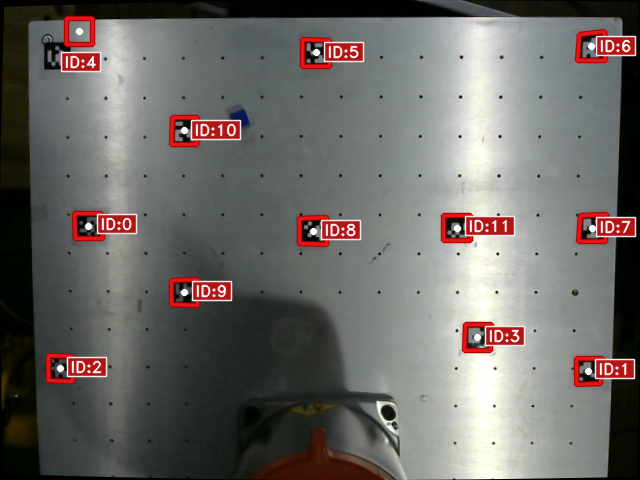

# KUKA ROS 2 Pick-and-Place — Operations Manual

This repository provides a complete ROS 2 pick-and-place pipeline for the KUKA KR6 R900-2 using Ethernet KRL Interface (EKI). Motion planning is performed with MoveIt, while trajectory execution is handled directly through a dedicated FollowJointTrajectory controller that communicates with the KRC4 controller over EKI.

## 1. Establishing the Bridge

To connect your system to the real robot, do as follows.

**On the KUKA SmartPAD:**
1. Flip the key to the right and switch from **T1** to **AUT**.
   
   
   
2. Select **ros_eki**.
   
3. Press the green and white buttons (start key) behind the SmartPAD to start the program.
   
4. Press the green play button on the side to run the program.
   - To pause the robot at any time, press the red pause button.

**On your system**, after the SmartPAD steps above are complete:
```bash
ros2 run kuka_eki_bridge kuka_eki_controller
```


This connects the system to the robot via **port 54600** through KUKA IP address
**`192.168.1.147`**.

---

## 2. Software Stack

Once communication with the KUKA KRC4 controller has been successfully established, launch the remaining ROS 2 software stack. Run each command in its own terminal, in the order shown below.

> **Rebuild first if anything changed:** if you've edited any core script, `setup.py`,
> or added a new node since the last run, rebuild the workspace before launching
> anything below:
> ```bash
> cd ~/kuka_ros2
> colcon build --continue-with-error
> ```

**Terminal 1 — MoveIt planning and EKI controller:**
```bash
ros2 launch kuka_eki_bridge eki_moveit_planning.launch.py
```


**Terminal 2 — Control server:**
```bash
ros2 run kuka_ros2_demo control_server
```


**Terminal 3 — Vision node:**
```bash
ros2 run kuka_ros2_demo vision_node
```


**Terminal 4 — Voice input** (choose one):
```bash
ros2 run kuka_ros2_demo voice_ai_node        # real voice input
ros2 run kuka_ros2_demo voice_terminal_mock  # terminal-menu based input
```


**Terminal 5 — Pick-place coordinator:**
```bash
ros2 run kuka_ros2_demo pick_place_coordinator
```


This is enough to run and test the full pipeline in simulation.

---

## 3. Where to Make Logic Changes


| To change... | Edit... |
|---|---|
| How the robot "sees" objects | `vision_node` (HSV color detection) or `detect_node` (YOLO segmentation `.pt` model) |
| Object detection method | Swap `vision_node` ↔ `detect_node` (see below) |
| Pick/place pose constants | `pick_place_constants.py` |
| Voice command handling | `voice_ai_node` or `voice_terminal_mock` |
| Overall pick-place logic / IK issues | `pick_place_coordinator.py` |

### Vision node vs. detect node
- **`vision_node`** — uses HSV color thresholding to detect **red, green, blue, and
  yellow** objects.
- **`detect_node`** — uses a `.pt` file (typically a **YOLO segmentation** model) to
  identify objects instead of color.

Either node is also responsible for telling the robot **where** the object/cube is on
the workspace. This works by treating the ArUco markers on the workspace as reference
points, computing a **homography** from them, and using that homography (saved during
calibration) to convert the object's pixel location into a real-world distance from the
robot's origin `[0, 0, 0]`.

---

## 4. Calibrating the Robot Camera

### 4.1 ArUco marker layout

The following markers are fixed to the workspace at these coordinates:

| Marker ID | X (mm) | Y (mm) |
|---|---|---|
| 0  | 303.11 | 299.80 |
| 1  | 112.55 | -344.22 |
| 2  | 157.78 | -201.06 |
| 3  | 115.11 | 342.09 |
| 4  | 522.11 | 337.59 |
| 5  | 521.76 | 6.73 |
| 6  | 527.19 | -337.73 |
| 7  | 298.08 | -344.08 |
| 8  | 293.85 | 9.34 |
| 9  | 216.57 | 174.20 |
| 10 | 422.84 | 174.79 |
| 11 | 298.34 | 176.92 |


### 4.2 Positioning the wrist camera

1. On the KUKA SmartPAD, press the white key and switch to **world frame**.
2. Go to **Menu > Display > Actual Position** to monitor the end effector's pose and
   orientation live while you jog it into place.
3. Manually jog the arm using the **X, Y, Z** (position) and **A, B, C** (orientation)
   buttons until the wrist-mounted camera has the full workspace in view (see reference
   image — all markers visible, workspace unobstructed).

   Typical known-good pose for this view:
   - Position (X, Y, Z): **338.56, 10.12, 1091.51**
   - Orientation (A, B, C): **-173.42, 28.68, 179.71**

### 4.3 Previewing and capturing an image

Navigate to the data directory:
```bash
cd kuka_ros2/src/kuka_ros2_demo/data
```

Stream the camera live to check framing/orientation:
```bash
python3 -c "
import cv2
cap = cv2.VideoCapture(2)
while True:
    ret, frame = cap.read()
    if not ret:
        break
    cv2.imshow('Live Stream', frame)
    if cv2.waitKey(1) & 0xFF == ord('q'):
        break
cap.release()
cv2.destroyAllWindows()
"
```
Press **`q`** to stop streaming once the full workspace is visible and correctly framed.

Then capture a still frame for calibration:
```bash
python3 -c "
import cv2
cap = cv2.VideoCapture(2)
ret, frame = cap.read()
cv2.imwrite('frame.png', frame)
cap.release()
"
```
Confirm `frame.png` now exists in the `data` folder before continuing.


### 4.4 Computing the homography

```bash
python3 updated_aruco.py frame.png
```

This prints calibration output to the terminal and also writes **`aruco_debug.png`**.
Open `aruco_debug.png` and check how many of the 12 ArUco markers were actually detected
and used — each detected marker is annotated with its ID and a bounding box, so you can
confirm coverage across the workspace before trusting the calibration.



### 4.5 Validating the calibration

1. Place a colored cube somewhere on the workspace.
2. Snap a new image using the capture command from step 4.3.
3. Run:
   ```bash
   python3 vision.py frame.png
   ```
4. This outputs the object's computed **X, Y** coordinates.
5. Manually jog the robot (via SmartPAD) to that X, Y point and visually confirm it
   lines up with the actual cube position. If it's off, recheck the camera framing and
   re-run the calibration (steps 4.3–4.4).

### 4.6 Pose constants

- Default pick/place pose values are stored as quaternions/transforms in
  **`pick_place_constants.py`**.
- `pick_place_coordinator.py` simply imports these values in order — so future tuning
  only requires editing `pick_place_constants.py`, not the coordinator logic itself.
- **Pick height is currently fixed** (no depth estimation). This will remain constant
  until either:
  - a second camera is added for stereo depth estimation, or
  - the wrist camera is replaced/supplemented with a depth camera (e.g. **Intel
    RealSense D435**).

---

## 5. Voice Input

- Edit **`voice_ai_node`** or **`voice_terminal_mock`** to change voice/text command
  handling.
- `voice_ai_node` currently uses **Vosk-STT** to convert spoken audio into text.
- The recognized text is passed from the voice terminal over to the `vision_node`
  terminal, which checks whether the named object is present on the workspace.

---

## 6. Troubleshooting

- **"No solution for IK" errors:**
  - Debug `pick_place_coordinator.py` first.
  - If unresolved, reset the robot to its home position by running the first part of
    **`trialrun1`** in **T1 mode** on the SmartPAD.

---

## 7. Future Plans

| Plan | Risk | Return |
|---|---|---|
| Add a second camera for Z coordinate estimation | No risk | High return |
| Convert the Python `rclpy` packages to C++ packages for faster execution | No risk | Mid return |
| Use `kuka_external_control_sdk` for direct communication with the KRC4 controller | High risk | High return (much later) |
